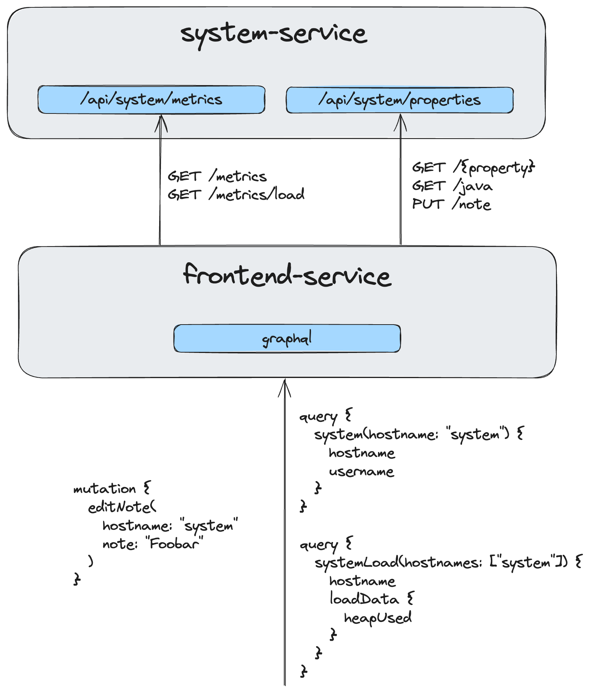

# GraphQL Demo using OpenLiberty

This demo application is for learning purposes of GraphQL, OpenLiberty and MicroProfile.

## Overview

The following diagram gives an overview of the services and APIs of this application:



It is an adaptation of the [Optimizing REST queries for microservices with GraphQL](https://openliberty.io/guides/microprofile-graphql.html)
example, but using Gradle instead of Maven. And more recent versions of the libraries and tools.

## Getting started

You can run the dev server of both services using Gradle and the `libertyDev` command:

```bash
./gradlew :system-service:libertyDev
./gradlew :frontend-service:libertyDev
```

To just package the WAR file, use the `war` task of the respective service:

```bash
./gradlew :frontend-service:war
```

If you want to run the services in containers instead, you can build the containers using the following command:

```bash
docker build -t system-service:1.0-SNAPSHOT system-service/.
docker build -t frontend-service:1.0-SNAPSHOT frontend-service/.
```

And then start the containers using:

```bash
./scripts/containersUp.sh
```

And finally, to clean up the mess, use the following commands:

```bash
./scripts/containersDown.sh
./gradlew clean
```

### Example URLs

- **Example REST endpoint**: http://localhost:9080/api/system/metrics
- **GraphQL UI**: http://localhost:9081/graphql-ui
- **GraphQL Schema**: http://localhost:9081/graphql/schema.graphql

## Troubleshooting

### Dev Mode

At the time of writing, the `./gradlew libertyDev` Gradle task seems to have troubles in a multi-module
project, such as this one. For more details,
see [Multi-module support for dev mode with Gradle](https://github.com/OpenLiberty/ci.gradle/issues/625).

### GraphQL

Somehow, on ly local machine, when I start the `frontend-service` GraphQL application,
once a `@GraphQLApi` annotated class contains a `@Query` or `@Mutation` annotation,
then the server starts, but not the web application:

```
CWWKZ0012I: The application frontend-service-1.0-SNAPSHOT was not started.
```

I could not figure out why that is. And why it works fine when using a cloud-hosted
environment, such as [here](https://labs.cognitiveclass.ai/v2/tools/cloud-ide-kubernetes?ulid=ulid-812456d6b35c82f3977b79e38eeef955c035f3b4).
